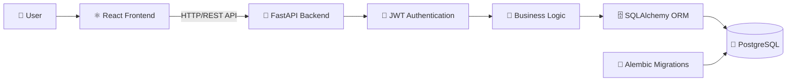

# 🚀 JobSphere – Full Stack Job Portal Website

**JobSphere** is a full-stack job portal website that connects job seekers with recruiters through a modern and secure web application. It enables applicants to create profiles, search and apply for jobs, while allowing recruiters to post job openings and manage applications efficiently.

The project is built using **React** for the frontend, **FastAPI** for the backend, and **PostgreSQL** as the database. It follows a modular architecture with secure authentication, role-based access control, database migrations using Alembic, and a scalable backend powered by SQLAlchemy ORM.

This project was developed to gain hands-on experience in building a real-world full-stack web application using modern technologies and industry best practices.

---

# 🌐 Tech Stack

## Frontend

* React.js
* JavaScript (ES6+)
* HTML5
* CSS3

## Backend

* Python
* FastAPI

## Database

* PostgreSQL

## ORM

* SQLAlchemy

## Database Migration

* Alembic

## Authentication & Security

* JWT Authentication
* Passlib (bcrypt)
* Email Verification
* Password Reset via Email

## Validation

* Pydantic v2

## API Testing

* Postman

## Version Control

* Git
* GitHub

---

# ✨ Key Features

### 👤 Applicant

* Register and verify email
* Secure login with JWT authentication
* Create and update profile
* Search and filter jobs
* View job details
* Apply for jobs
* Track application status
* Withdraw applications

### 🏢 Recruiter

* Secure recruiter registration
* Create and manage company profile
* Post new job openings
* Edit and delete jobs
* Activate or deactivate jobs
* Feature important job postings
* View applicants
* Update application status

### 🔒 Authentication & Security

* User Registration
* Email Verification
* Secure Login
* JWT Authentication
* Password Hashing
* Forgot Password
* Reset Password
* Protected Routes
* Role-Based Authorization

### ⚙️ Application Features

* Pagination
* Search
* Filtering
* Sorting
* RESTful API Architecture
* Database Migrations with Alembic
* Modular Project Structure
* Input Validation
* Error Handling  

# 🏗️ System Architecture

## 📖 Architecture Overview

- **React** provides a responsive and interactive user interface for applicants and recruiters.
- **FastAPI** handles REST API requests, business logic, and communication with the database.
- **JWT Authentication** secures protected routes and enables role-based access control.
- **SQLAlchemy** serves as the ORM for efficient database operations.
- **PostgreSQL** stores user accounts, jobs, applications, and profile data.
- **Alembic** manages database schema migrations and version control.
